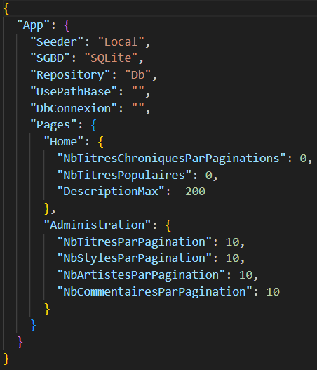

# Dossier de configuration

Pour tester le code en local :

La commande suivante, exécutée dans le dossier Webzine.WebApplication, permet de
lancer le projet :

`dotnet run --urls "http://localhost:5000"`

Vous pourrez donc accéder au projet dans votre navigateur en local à l'adresse
suivante: http://localhost:5000

Pour une configuration avec des données mockées, il faut modifier l'appsettings.

Les options de configuration sont les suivantes :

| **Paramètre**            | **Description**                              | **Options/Valeurs**         | **Valeur par défaut** |
|:-------------------------|:---------------------------------------------|:---------------------------:|:---------------------:|
| **Seeder**               | Choix du type de données initiales           | `Local`, `Deezer`, `Ignore` | `Local`               |
| **SGBD**                 | Système de gestion de base de données        | `SQLite`, `SQLServer`, `PG` | `SQLite`              |
| **Repository**           | Source des données                           | `Local` (mock), `Db` (BDD)  | `Db`                  |
| **UsePathBase**          | Path de base pour le déploiement             | Chaîne (ex: `/mon-app`)     | `/`                   |
| **NbTitresChroniques...**| Chroniques par page (accueil)                | Entier positif              | `3`                   |
| **DescriptionMax**       | Caractères max pour les chroniques           | Entier positif              | `200`                 |
| **NbTitresPopulaires**   | Titres populaires à afficher                 | Entier positif              | `3`                   |
| **NbTitresParPagination**| Titres par page                              | Entier positif              | `10`                  |
| **NbStylesParPagination**| Styles par page                              | Entier positif              | `10`                  |
| **NbArtistesParPagin...**| Artistes par page                            | Entier positif              | `10`                  |
| **NbCommentairesPar...** | Commentaires par page                        | Entier positif              | `10`                  |

Il est possible en mode Production d'implémenter un fichier exclusif appelé
appsettings.Production.json.

Il suffit d'ajouter dans les variable d'environnement la variable
ASPNETCORE_ENVIRONMENT avec la valeur "Production".