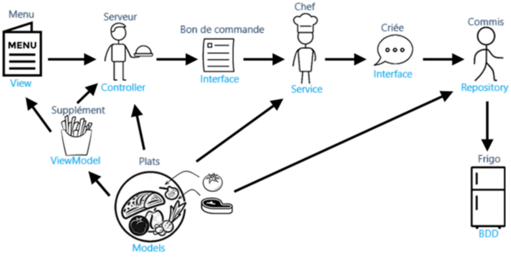

## Organisation de la Collaboration Dev / Ops

Nous avons eu de nombreux échanges durant les daily meetings et lors de leur
préparation. En fin de semaine, nous avons également organisé une explication
croisée de nos réalisations respectives, ce qui a permis à chacun de partager ce
qu'il avait accompli durant la semaine.

Étant dans la même salle, nous avons aussi beaucoup échangé de manière
informelle sur nos travaux respectifs. Tout au long de la semaine, nous avions
une bonne visibilité sur l'organisation des ops et sur ce qu'ils faisaient.

Une grande partie de la communication est également passée par un canal Teams
partagé avec toute l'équipe. Un avantage de ce moyen de communication est qu'il
permet de toujours être au courant de ce qui se passe du côté ops ou dev de
l'équipe, car même si certains détails techniques ne sont pas compréhensibles,
tous les membres de l'équipe suivent les échanges et le travail des autres
membres de l'équipe

Nous avons aussi fait des échanges avant la présentation client pour pouvoir
avoir un point de vue commun sur ce qui avait été fait.

Nous avons aussi profité du TOS pour expliquer aux ops ce que nous avions fait
dans notre code, comment il était organisé et pourquoi. Je vous joins d'ailleurs
un schéma que nous avons fait pour leur expliquer, en prenant comme métaphore
l'organisation d'un restaurant.

